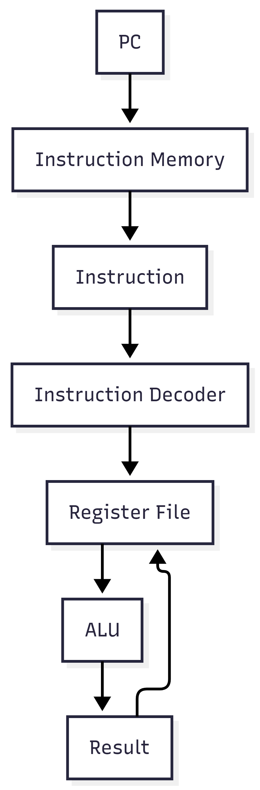
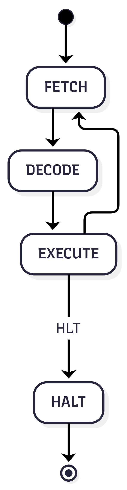
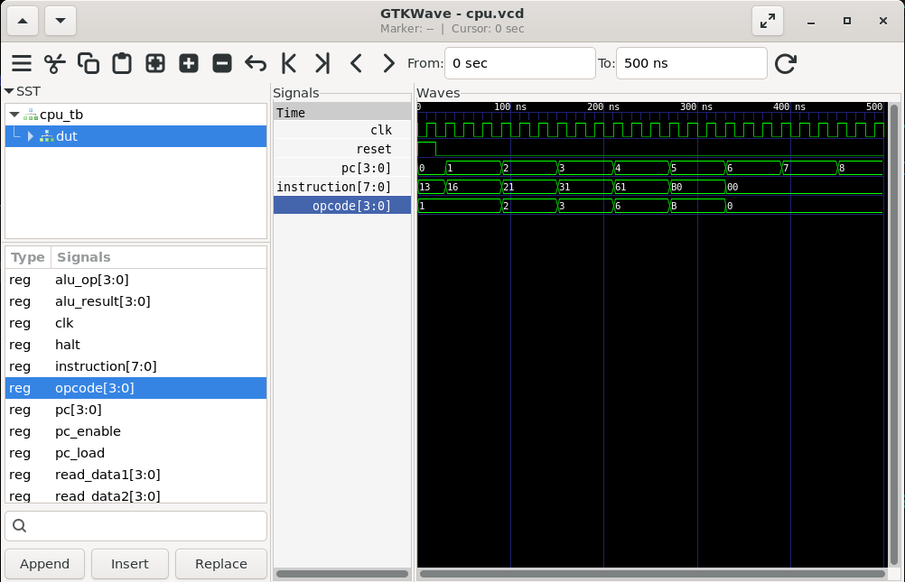
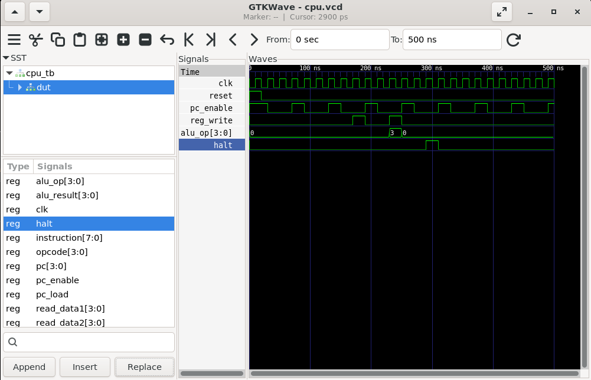
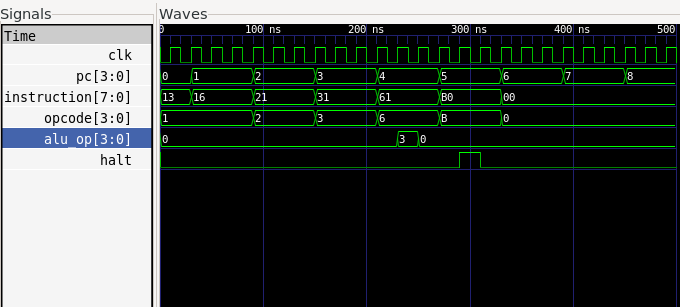

# 4-bit Processor in VHDL


A modular implementation of a **4-bit educational processor** in **VHDL**, developed as part of a **Digital Electronics & VLSI Systems Internship**. The project demonstrates the fundamental building blocks of a processor, including the Program Counter, Register File, Arithmetic Logic Unit (ALU), Instruction Memory, and an FSM-based Control Unit.

The processor is designed to illustrate the **Fetch–Decode–Execute** instruction cycle through simulation using **GHDL** and waveform verification with **GTKWave**.

---

# Features

* 4-bit Processor Architecture
* FSM-based Control Unit
* Program Counter (PC)
* 4 × 4-bit Register File
* 4-bit Arithmetic Logic Unit (ALU)
* Instruction Memory (ROM)
* Fetch–Decode–Execute Cycle
* Modular Hardware Design
* Zero Flag Generation
* HALT Instruction Support
* Simulation using GHDL
* Waveform Verification using GTKWave

---

# Processor Architecture

<p align="center">

</p>

The processor consists of five primary hardware modules:

* Program Counter
* Instruction Memory
* Register File
* Arithmetic Logic Unit (ALU)
* Control Unit

The Program Counter supplies instruction addresses to the Instruction Memory. Instructions are decoded by the Control Unit, which generates the required control signals. Operands are read from the Register File, processed by the ALU, and the results are written back to the registers. The Zero Flag generated by the ALU is available for future conditional branching operations.

---

# Processor Datapath

<p align="center">

</p>

The datapath illustrates how information flows through the processor during execution.

Execution sequence:

```
Program Counter
      ↓
Instruction Memory
      ↓
Instruction Decode
      ↓
Register File
      ↓
Arithmetic Logic Unit
      ↓
Result Write-back
      ↓
Next Instruction
```

---

# Repository Structure

```text
4bit-Processor/
│
├── README.md
│
├── src/
│   ├── alu.vhd
│   ├── control_unit.vhd
│   ├── cpu_top.vhd
│   ├── instruction_memory.vhd
│   ├── program_counter.vhd
│   └── register_file.vhd
│
├── tb/
│   └── cpu_tb.vhd
│
├── docs/
│   ├── architecture.png
│   ├── module_hierarchy.png
│   ├── datapath.png
│   └── control_fsm.png
│
└── waveforms/
    ├── cpu_execution.png
    ├── control_signals.png
    ├── halt_instruction.png
    └── cpu.vcd

```

---

# Module Description

## 1. Program Counter

Maintains the address of the next instruction to be executed.

### Inputs

* clk
* reset
* enable
* load
* pc_in

### Output

* pc_out

---

## 2. Instruction Memory

Stores the processor program as a ROM.

### Input

* address

### Output

* instruction

---

## 3. Register File

Contains four general-purpose 4-bit registers used to store operands and computation results.

### Features

* Dual asynchronous read ports
* Single synchronous write port

---

## 4. Arithmetic Logic Unit (ALU)

Performs arithmetic and logical operations on register operands.

Supported operations:

* ADD
* SUB
* AND
* OR
* XOR
* NOT

Additional output:

* Zero Flag

---

## 5. Control Unit

Implements the processor control logic using a Finite State Machine (FSM).

Responsibilities:

* Instruction decoding
* ALU operation selection
* Register write control
* Program Counter control
* Processor halt control

---

## 6. CPU Top Module

Integrates all processor modules into a complete CPU architecture.

---

# Control Unit FSM

<p align="center">

</p>

Execution sequence:

```text
FETCH
   ↓
DECODE
   ↓
EXECUTE
   ↓
FETCH
```

The Control Unit coordinates the processor by generating the appropriate control signals during each execution stage.

---

# Instruction Set

| Opcode | Instruction | Description    |
| ------ | ----------- | -------------- |
| 0000   | NOP         | No Operation   |
| 0001   | LDI         | Load Immediate |
| 0010   | MOV         | Move Register  |
| 0011   | ADD         | Addition       |
| 0100   | SUB         | Subtraction    |
| 0101   | AND         | Bitwise AND    |
| 0110   | OR          | Bitwise OR     |
| 0111   | XOR         | Bitwise XOR    |
| 1000   | NOT         | Bitwise NOT    |
| 1001   | JMP         | Jump           |
| 1010   | JZ          | Jump if Zero   |
| 1011   | HLT         | Halt Processor |

---

# Simulation

## Processor Execution

<p align="center">

</p>

The simulation demonstrates:

* Clock generation
* Reset sequence
* Program Counter increment
* Instruction fetch
* Opcode decoding

---

## Control Signals

<p align="center">

</p>

The Control Unit generates and controls:

* Program Counter Enable
* Register Write Enable
* ALU Operation Select
* Halt Signal

---

## Halt Instruction

<p align="center">

</p>

The waveform confirms successful recognition of the **HLT** instruction, terminating processor execution through the Control Unit.

---

# Running the Simulation

Compile all modules

```bash
ghdl -a src/*.vhd
ghdl -a tb/cpu_tb.vhd
```

Elaborate

```bash
ghdl -e cpu_tb
```

Run simulation

```bash
ghdl -r cpu_tb --stop-time=500ns --vcd=cpu.vcd
```

Open waveform

```bash
gtkwave cpu.vcd
```

---

# Results

The processor architecture was successfully verified through simulation.

Verified functionality includes:

* Modular processor architecture
* Program Counter operation
* Instruction fetch
* Opcode decoding
* FSM-based Control Unit
* ALU operation selection
* Register File integration
* HALT instruction detection

---

# Applications

* Computer Architecture Education
* Digital Logic Design
* FPGA Design Fundamentals
* Embedded Systems
* Processor Design
* Hardware Design Education
* VLSI System Design

---

# Tools Used

* VHDL
* GHDL
* GTKWave
* Draw.io
* Git & GitHub

---

# Future Improvements

* Data Memory (RAM)
* Stack Pointer
* CALL / RET Instructions
* Memory-Mapped I/O
* Interrupt Handling
* Pipeline Architecture
* FPGA Implementation
* Expanded Instruction Set

---

# References

* IEEE Standard VHDL Documentation
* Computer Organization and Design
* Digital Design and Computer Architecture
* GHDL Documentation
* GTKWave Documentation

---