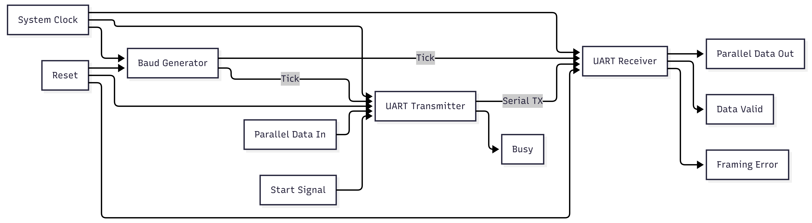
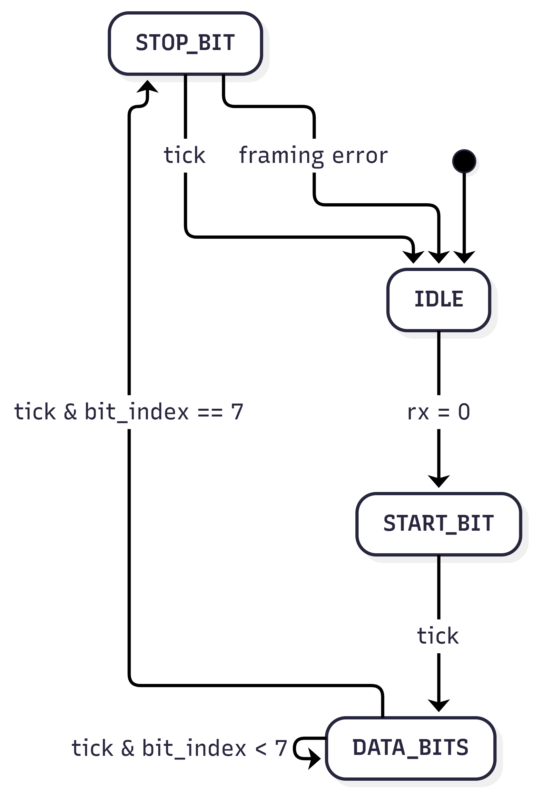
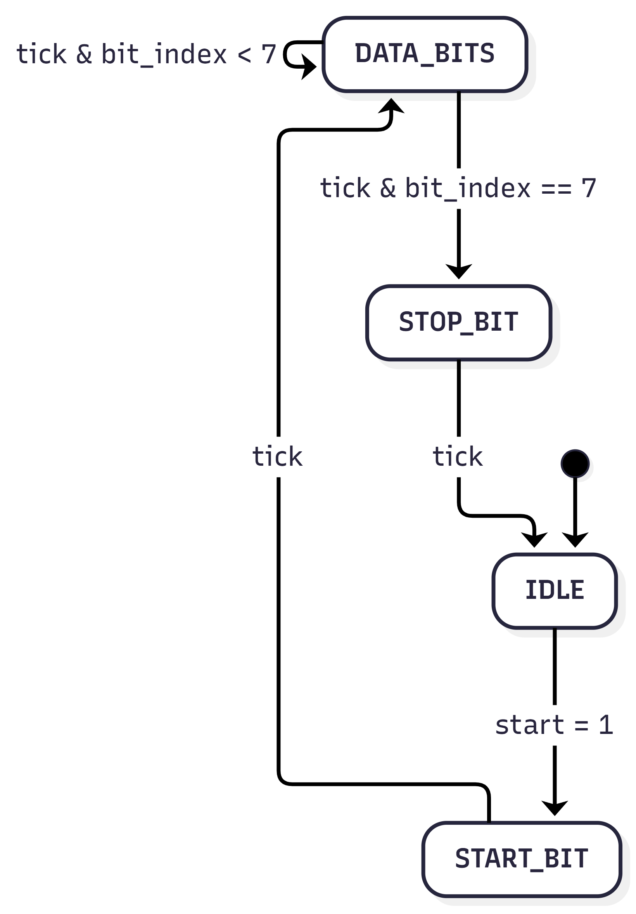
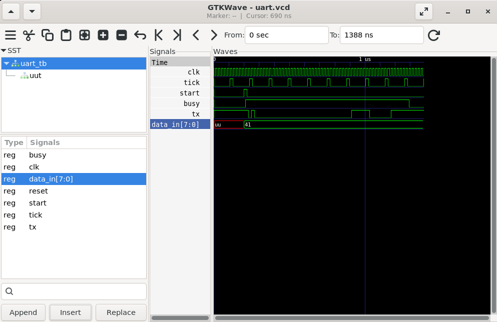
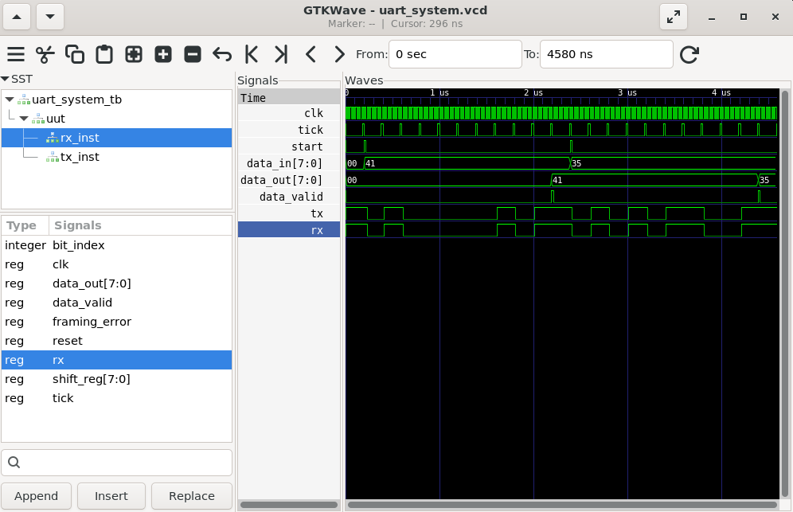

# UART Protocol Implementation in VHDL


A complete implementation of the **Universal Asynchronous Receiver/Transmitter (UART)** communication protocol in **VHDL**. The project was developed as part of a **Digital Electronics & VLSI Systems Internship** and demonstrates the design, implementation, and verification of a UART communication system through simulation.

The project includes a baud rate generator, UART transmitter, UART receiver, integrated top module, and comprehensive simulation testbenches verified using **GHDL** and **GTKWave**.

---

# Features

- UART Transmitter (TX)
- UART Receiver (RX)
- Baud Rate Generator
- UART Top Module
- Loopback Communication
- Self-checking Testbench
- Framing Error Detection
- Modular Design
- GTKWave Verification

---

# UART Frame Format

The implemented UART uses the standard **8N1** frame format.

| Field | Bits |
|-------|------|
| Start Bit | 1 |
| Data Bits | 8 |
| Parity | None |
| Stop Bit | 1 |

Transmission order:

```
Idle → Start → D0 → D1 → D2 → D3 → D4 → D5 → D6 → D7 → Stop
```

Data bits are transmitted **Least Significant Bit (LSB) first**.

---

# Project Architecture

<p align="center">

</p>

The complete communication system consists of four major modules:

- Baud Generator
- UART Transmitter
- UART Receiver
- UART Top Module

The baud generator provides timing pulses used by both the transmitter and receiver. The transmitter converts parallel input data into a serial stream, while the receiver reconstructs the original byte from the incoming serial data.

---

# Repository Structure

```
UART-VHDL/
│
├── README.md
│
├── src/
│   ├── baud_generator.vhd
│   ├── uart_tx.vhd
│   ├── uart_rx.vhd
│   └── uart_top.vhd
│
├── tb/
│   ├── uart_tb.vhd
│   └── uart_system_tb.vhd
│
├── docs/
│   ├── architecture.drawio
│   ├── architecture.png
│   ├── commands.txt
│   ├── tx_fsm.drawio
│   ├── tx_fsm.png
│   ├── rx_fsm.drawio
│   └── rx_fsm.png
│
└── waveforms/
    ├── uart_tx.png
    ├── uart_system.png
    ├── uart.vcd
    └── uart_system.vcd
```

---

# Module Description

## 1. Baud Generator

Generates periodic baud timing pulses from the system clock.

### Inputs

- clk
- reset

### Output

- tick

---

## 2. UART Transmitter

Responsible for converting an 8-bit parallel input into serial UART data.

### States

- IDLE
- START_BIT
- DATA_BITS
- STOP_BIT

---

## 3. UART Receiver

Receives serial UART data and reconstructs the original byte.

### States

- IDLE
- START_BIT
- DATA_BITS
- STOP_BIT

Additional output:

- framing_error

---

## 4. UART Top

Integrates both transmitter and receiver into a complete UART communication system.

---

# Finite State Machines

## UART Transmitter

<p align="center">

</p>

State sequence:

```
IDLE
 ↓
START_BIT
 ↓
DATA_BITS
 ↓
STOP_BIT
 ↓
IDLE
```

---

## UART Receiver

<p align="center">

</p>

State sequence:

```
IDLE
 ↓
Detect Start Bit
 ↓
Receive Data Bits
 ↓
Stop Bit
 ↓
Output Data
 ↓
IDLE
```

---

# Simulation

## UART Transmitter

<p align="center">

</p>

The transmitter simulation verifies:

- Start bit generation
- LSB-first transmission
- Stop bit generation
- Busy signal behaviour

---

## UART Loopback Communication

<p align="center">

</p>

The complete UART system simulation verifies:

- Correct transmission
- Correct reception
- Data reconstruction
- Successful loopback communication
- No framing errors

---

# Test Cases

| Input | Expected Output | Result |
|--------|-----------------|--------|
| 0x41 ('A') | 0x41 | PASS |
| 0x35 ('5') | 0x35 | PASS |
| 0xFF | 0xFF | PASS |
| 0x00 | 0x00 | PASS |
| 0xAA | 0xAA | PASS |

---

# Running the Simulation

Compile all modules

```bash
ghdl -a src/baud_generator.vhd
ghdl -a src/uart_tx.vhd
ghdl -a src/uart_rx.vhd
ghdl -a src/uart_top.vhd
ghdl -a tb/uart_system_tb.vhd
```

Elaborate

```bash
ghdl -e uart_system_tb
```

Run simulation

```bash
ghdl -r uart_system_tb --vcd=uart_system.vcd
```

Open waveform

```bash
gtkwave uart_system.vcd
```

---

# Results

The UART communication system was successfully verified through simulation.

Verified functionality includes:

- Correct baud timing
- UART frame generation
- LSB-first transmission
- Successful byte reconstruction
- Loopback communication
- Framing error detection

---

# Applications

- FPGA Development
- Embedded Systems
- Microcontroller Communication
- Serial Interfaces
- Debug Interfaces
- IoT Devices
- Digital Communication Systems

---

# Tools Used

- VHDL
- GHDL
- GTKWave
- Draw.io
- Git & GitHub

---

# References

- IEEE Standard VHDL Documentation
- UART Communication Protocol
- GHDL Documentation
- GTKWave Documentation

---